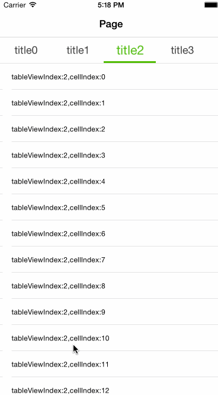

# BHSlidePageView

###内部实现
  在 SlideView 内部存在一个UIScrollView, 在 scrollView 滚动结束后,加载当前 index
以及其左右的 tab, 如果快速滑动,在一些时候, SlidePage 为了流畅显示,将使用 delegate 默认
返回的占位图,滑动停止后加载视图.
  全局使用三个 view 实例通过来回移动 view 的位置,以及在 delegate 中重置数据达到复用.
  复用方式参考了 Android listView 的 ListViewAdapter 的方式.

###使用场景
  多个 tab, 每个 tab 内容类似,多用于同内容的不同分类,如新闻类等.使用 SlidePageView控
件封装好了复用的细节,只需要在 delegate 中做简单的处理,如 reload 之类.

###演示效果


###使用方法
#####主要方法-(UIView*)slidePage:(NSInteger)index contentView:(UIView * )contentView status:(NSObject*)obj;
  delegate 中的一个方法,contentView是每一个 tab 的内容 如果为空,手动初始化并返回,
如果不为空说明是一个被复用的内容可以在方法中对视图的数据进行 reload.index 是该 contentView
的索引位置,可以用来存取数据, status可以用来保存每个 view 的数据无关的状态,如 tableView 的
位置等等.
    该方法在 SlidePage 将要显示新的页面的时候会被调用.

#####如果非常快速的切换 tab 将会显示一个默认的  占位符,

```objective-c

-(UIView*)slidePage:(NSInteger)index contentView:(UIView * )contentView status:(NSObject*)obj{
    UITableView *tableView;
    if(contentView==nil){
        tableView = [[UITableView alloc] initWithFrame:CGRectMake(0, 0, [UIScreen mainScreen].bounds.size.width, [UIScreen mainScreen].bounds.size.height)];
        //利用 tag 标记 tabeView 的 index, 在 tableView 的 delegate 中使用.
        tableView.tag = index+1000;
        [tableView registerClass:[UITableViewCell class] forCellReuseIdentifier:@"aaa"];
        tableView.dataSource = self;
        tableView.delegate = self;
    }else{
        
        tableView = (UITableView*)contentView;
        tableView.tag = index+1000;
        [tableView reloadData];
        [tableView setContentOffset:CGPointFromString([obj description])];
    }
    return tableView;
}

```

###BHSlideViewTitleBar的配置

通过BHTitleBarDelegate来配置 title 的颜色字体缩放动画等一些属性,其中注意的是一些 optional 方法
需要同时实现,配置动画颜色请指定 RGB 值,不要直接使用类似[UIColor yellowColor]这样的.
可以做到对一些如颜色动画,缩放动画,字体颜色等等的.
需要侦听 TitleBar 的一些点击,可以设置BHTitleBarOnClickListener这个 delegate.
可以重写updateCursorPositionForSlidePage方法可以自定义想要的动画.

###如何使用
-  可以直接下载 Classes 文件

-  也可使用 pod,下载 podspec 文件,本地引用直接在 podfile 中集成
